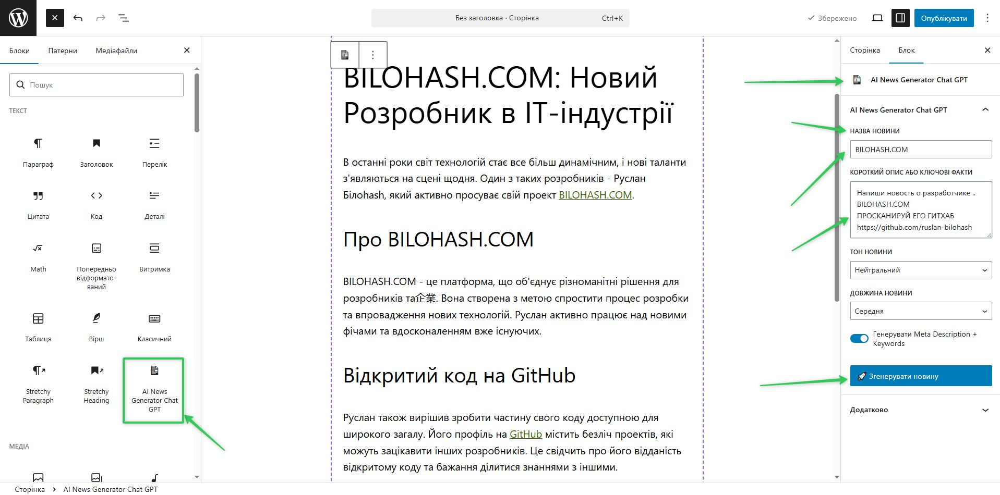
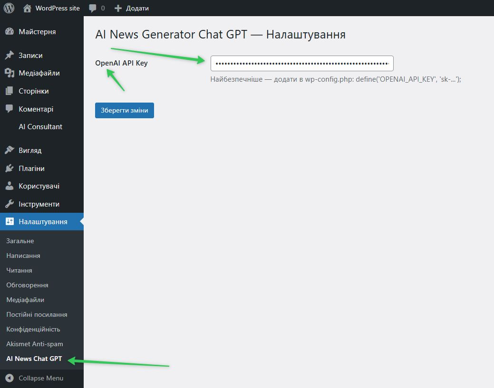

# 🚀 AI News Generator Chat GPT

**Powerful AI News Generator for WordPress** — creates full professional news articles, headlines, subheadings, Meta Description and Meta Keywords using ChatGPT / OpenAI directly in the Gutenberg editor.

**Version:** 1.0.0  
**Author:** RUSLAN BILOHASH 
**License:** GPL-2.0+

---

## ✨ Key Features

- Generate complete news articles in Ukrainian in seconds
- Only need title + short description → AI creates full ready-to-publish news
- Automatically generates **Meta Description** and **Meta Keywords** for SEO
- 4 professional tones: Neutral, Formal, Sensational, Analytical
- 3 length options: Short, Medium, Long
- Beautiful output styled with Tailwind CSS
- Modern and clean Gutenberg block interface

---

## 📸 Screenshots

  
*Block settings panel – easy to use interface*

  
*Example of fully generated news article with meta tags*

---

## Requirements

- WordPress 6.4 or higher
- PHP 8.2 or higher
- OpenAI API Key
- Gutenberg (Block Editor) enabled

---

## 🚀 Installation

1. Download the plugin
2. Upload the folder to `/wp-content/plugins/ai-news-generator-chat-gpt/`
3. Activate **"AI News Generator Chat GPT"** in WordPress → Plugins
4. Go to **Settings → AI News Chat GPT** and enter your OpenAI API Key

**Most secure way** (recommended):
Add to your `wp-config.php`:
```php
define('OPENAI_API_KEY', 'sk-XXXXXXXXXXXXXXXXXXXXXXXXXXXXXXXX');
