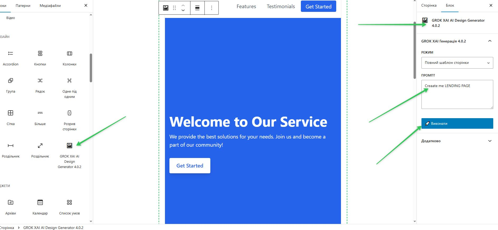

# 🚀 GROK XAI AI Design Generator

**The most powerful AI-powered design tool for WordPress** — instantly creates and edits blocks, full page templates, and complete Block Themes using OpenAI directly inside the Gutenberg editor.


**Version:** 4.0.2  
**Author:** Grok + Руслан  
**License:** GPL-2.0+

---

## ✨ Key Features

- Generate beautiful **single blocks** (forms, heroes, cards, testimonials, etc.) with Tailwind CSS
- Create **full page templates** with realistic demo content
- Build **complete Block Themes** — automatically creates a new theme folder in `/wp-content/themes/`
- **Edit any existing theme** — select any installed theme → choose any file → describe changes in plain language → AI updates the code instantly
- Automatic **backups** (`.bak` files) before every edit
- 100% **mobile-first & responsive** + built-in dark mode support
- Fully compatible with modern Gutenberg (iframe editor) — no deprecated warnings
- Enterprise-level security (nonces, capability checks, unique class name)
- Powered by **GPT-4o-mini** (fast and cost-effective)

---

## 📸 How It Works

1. Add the **"GROK XAI AI Design Generator"** block in Gutenberg
2. Choose one of 4 modes:
   - Single Block
   - Full Page Template
   - Create New Theme
   - **Edit Existing Theme**
3. Write your prompt (Ukrainian or English)
4. Click **"🚀 Execute"** — AI does everything in real time

---

## Requirements

- WordPress 6.4+
- PHP 8.2+
- OpenAI API Key
- Gutenberg (Block Editor) enabled

---

## 🚀 Installation

### Method 1: Manual (Recommended)

1. Download the repository as ZIP
2. Unzip it to `/wp-content/plugins/ai-design-generator/`
3. Go to **WordPress Admin → Plugins** and activate **GROK XAI AI Design Generator**
4. Go to **Settings → GROK XAI AI** and enter your OpenAI API Key

### Method 2: Via Git

```bash
cd wp-content/plugins/
git clone https://github.com/YOUR-USERNAME/ai-design-generator.git
